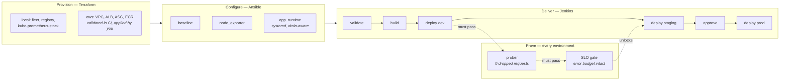

# proofline

**A delivery pipeline that proves its own claims.**

Terraform provisions it, Ansible configures it, Jenkins ships it, Kubernetes
runs it. So far, so ordinary. The part that isn't: every deployment has to prove
it was safe before the next environment will accept it.

```bash
make up      # kind cluster, fleet, monitoring, app, all local, all free
make prove   # deploy, and prove no request was dropped while doing it
make break   # deploy without the safety settings, and watch that proof fail
```

---

## Why

Almost every SRE CV says something like *"zero-downtime deployments."* Mine did.
Almost nobody measures it — the phrase means "we used a rolling update and
nobody complained."

A rolling update is not zero-downtime. It is zero-downtime *if* `maxUnavailable`
is 0, *if* readiness and liveness are different endpoints, *if* there is a
preStop hook long enough for endpoint propagation, *if* the grace period exceeds
the drain, and *if* the app actually drains on SIGTERM. Miss any one and you drop
connections on every deploy — quietly, because nothing is watching.

So this repo watches. A prober runs for the whole rollout and records every
request. One dropped connection fails the build.

```
FAIL  100 requests, 61 dropped
      - 61 request(s) failed (allowed 0): 61 connection_error
      - 61 consecutive failures (~3.05s of downtime), which means traffic was
        being dropped, not just an isolated error
```

Zero-downtime stops being a claim and becomes a test.

---

## The two gates

**1. The prober — did this rollout drop traffic?**

Runs against the *Service* (not a pod) for the duration of the rollout, plus a
tail afterwards to catch the old pods finishing termination. Classifies every
failure, and distinguishes an isolated 5xx from consecutive failures, because
those are different events: one is an error, the other is an outage.

It also refuses to pass on too few samples. A prober that dies after two
requests reports 100% availability and waves a broken rollout through — which is
how a check like this usually fails in practice.

**2. The SLO gate — did this deployment make the environment worse?**

After the rollout settles, the pipeline asks Prometheus. Over a 10-minute window
it compares the error ratio against the objective in `slo/slo.yaml`, and:

- too many errors → **blocked**
- not enough traffic to judge → **blocked**
- Prometheus returned nothing → **blocked**

That last one matters more than it looks. A `sum(rate(...))` over an empty
series returns `NaN`, and every comparison against `NaN` is false — so an
unguarded gate passes a build precisely when monitoring is broken.

Both gates archive their verdict as JSON, so a deployment's evidence outlives
the console log.

---

## Architecture



---

## Quickstart

**Requires:** Docker, `kind`, `kubectl`, `kustomize`, `helm`, `terraform`,
`ansible-core`, Python 3.11+.

Step-by-step instructions, including installing all of the above and what to do
when a stage fails, are in **[QUICKSTART.md](QUICKSTART.md)**. The short version:

```bash
make up                  # everything, locally, no cloud account
make prove ENV=dev       # deploy and prove it dropped nothing
make break               # deploy the unsafe overlay; the prober should fail
make burn                # inject 20% errors; the SLO gate should block
make ansible             # configure the server fleet
make ansible-idempotence # run it twice, fail if the second run changes anything
make jenkins             # Jenkins at :8081, configured entirely from code
make verify              # every offline check
make down                # tear it all down
```

`make help` lists everything.

---

## Every layer is checked

Most portfolio pipelines have no tests. This one is checked at each layer, and
all of it runs in CI without a cluster or a cloud account:

| Layer | Check | Catches |
|---|---|---|
| Kubernetes | Manifests validated against **upstream JSON schemas**, strict | Typos and misplaced fields |
| Kustomize | Overlay references and patch targets resolved | Patches that silently apply to nothing |
| Terraform | HCL parsed; every variable described; every provider pinned | Drift between the plan you reviewed and the plan that runs |
| Ansible | `ansible-lint` at the **production** profile, plus syntax check | Non-idempotent and unsafe tasks |
| Ansible | Playbook run twice; second run must change nothing | Roles that only work the first time |
| Python | 36 unit tests over the prober and gate logic | The gates themselves being wrong |

The Kubernetes one is worth dwelling on. `kubectl apply --dry-run=client` does
*not* catch a misplaced field. Write `readinesProbe` and it applies cleanly, does
nothing, and your pod has no readiness check — which surfaces as dropped requests
during a rollout, at an hour of the API server's choosing. Strict schema
validation catches it in CI:

```
FAIL deployment.yaml Deployment: spec.template.spec.containers.0:
     Additional properties are not allowed ('readinesProbe' was unexpected)
```

---

## Details worth stealing

**Measure through the path your users take.** The first working version of the
prober reached the service with `kubectl port-forward svc/proofline`. That
resolves the Service to *one* backing pod and tunnels to it — so a correct
rollout that replaced that pod looked like 18 seconds of downtime, while the
deliberately-broken overlay kept its tunnel and "passed". The results were
exactly inverted, and both looked plausible. It now hits a NodePort, which goes
through kube-proxy and load balances across every ready endpoint. A measurement
harness that does not share the production data path is measuring itself.

**`maxUnavailable: 25%` of 2 replicas is 0.** Percentages round down for
`maxUnavailable`. At two replicas the Kubernetes default is accidentally safe,
and only starts dropping traffic at four or more — so the "unsafe" overlay in
this repo has to say `maxUnavailable: 1` outright to misbehave at demo scale.

**Liveness and readiness are different questions.** Liveness asks "is this
process wedged"; readiness asks "should traffic come here now". Wiring both to
the same handler means a draining pod reports unhealthy, the kubelet restarts it
mid-drain, and a graceful shutdown becomes dropped connections.

**SIGTERM flips readiness, then keeps serving.** Kubernetes removes the pod from
Endpoints and sends SIGTERM *concurrently*, and every kube-proxy learns about it
asynchronously. A process that exits immediately drops what is still in flight.

**The preStop sleep is not superstition.** It holds the pod open while that
removal propagates. Omitting it is the single most common cause of
connection-refused errors during an otherwise correct rolling update — and
`k8s/overlays/broken/` exists so you can watch it happen.

**`maxUnavailable: 0`, not the default.** The default is 25%, which explicitly
permits a quarter of your capacity to be gone mid-rollout.

**The ALB has the same settings under different names.** `deregistration_delay`
is the preStop hook; `min_healthy_percentage = 100` on the ASG's instance
refresh is `maxUnavailable: 0`; ELB health checks rather than EC2 ones are the
readiness probe. Same ideas, different vocabulary — see `terraform/aws/`.

**Ansible runs `serial: 1`.** Configuration management across a serving fleet is
a rolling change like any other. Taking every host at once turns a bad playbook
into an outage instead of one failed host.

**The playbooks use only `ansible.builtin`.** They run on a bare `ansible-core`
install. The one collection in `requirements.yml` is for the local Docker
inventory — no task depends on it.

**The fleet containers run systemd.** So the roles use real `systemd` units and
work unchanged against EC2. A role that only works on containers is a role that
proves nothing about production.

---

## AWS

`terraform/aws/` is a real reference stack — VPC across multiple AZs, public
ALB, private auto scaling group, ECR with immutable tags and a lifecycle policy.
CI validates it. Nothing applies it automatically, because applying it costs
money:

```
ALB ~$18/mo + NAT ~$32/mo + 2x t3.small ~$30/mo  ≈  $80/mo (ap-south-1)
```

```bash
make aws-plan      # against your own account
make aws-apply
make aws-destroy   # the reason this target exists is that forgetting is normal
```

---

## What this is not

- **Not a production platform.** One demo service, a laptop cluster, and a
  Jenkins controller mounting the host Docker socket — fine for a demo, a
  privilege escalation on a shared controller.
- **The fleet containers are privileged.** Required to run systemd in Docker.
  It is the standard pattern for testing roles in containers, and it is not a
  pattern to copy anywhere else.
- **No TLS.** The ALB listens on port 80. Adding ACM and a redirect is a page of
  Terraform and would not demonstrate anything this repo is about.
- **The demo app is trivial on purpose.** The engineering is the pipeline around
  it, not the service inside it.

---

## Layout

```
app/          demo service; drain-aware, instrumented
prober/       the availability prober and its analysis  ← the differentiator
slo/          SLO definitions, Prometheus rules, promotion gate
k8s/          base + dev/staging/prod overlays, a deliberately broken one,
              and monitoring/ (applied only once the operator exists)
terraform/    local stack (free) and AWS reference (optional)
ansible/      fleet roles: baseline, node_exporter, app_runtime
jenkins/      Jenkinsfile, controller image, configuration as code
hack/         cluster setup, rollout probing, offline validator
```

## Licence

MIT.
